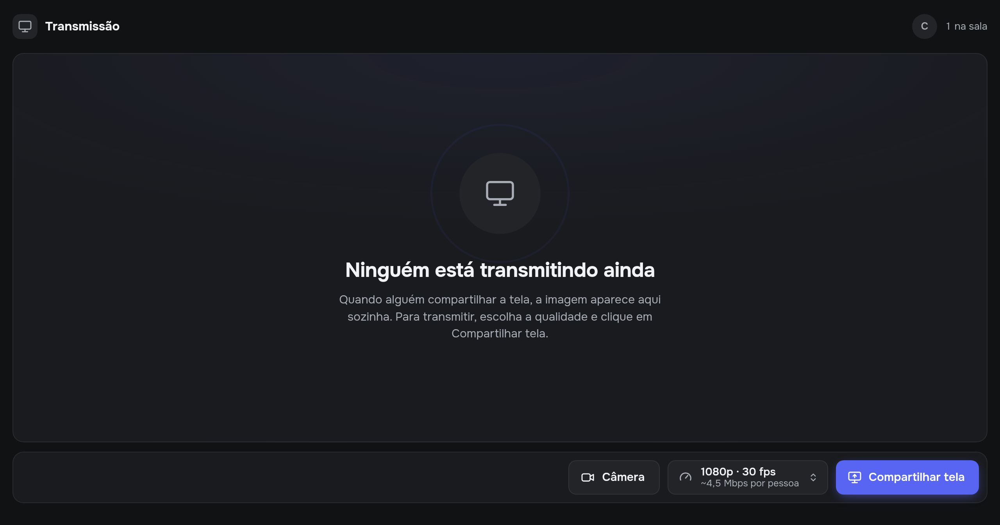
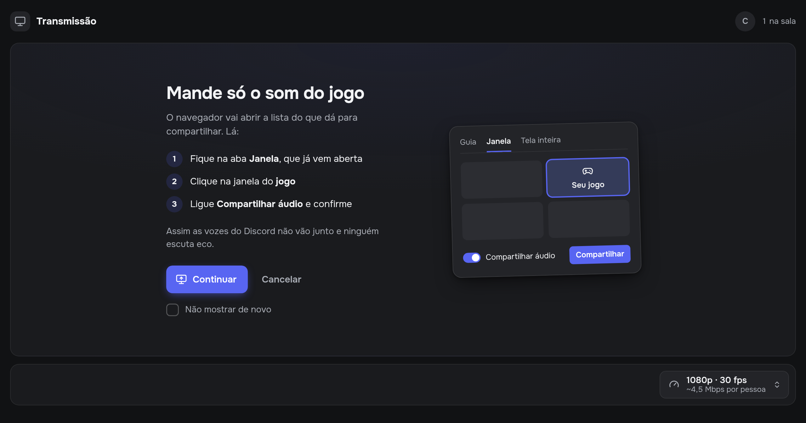

<p align="center"></p>

**rhut** é transmissão de tela para o seu servidor do Discord, direto no navegador.

Alguém digita `/live`, o bot posta um aviso no canal e todo mundo entra numa sala na web. Quem transmite compartilha a janela do jogo com o som dela, e o resto assiste com atraso baixo, em até 1080p a 60 fps. O vídeo vai direto de um navegador para o outro (WebRTC), sem passar por servidor, e tudo roda no plano gratuito da Cloudflare.



## Por que existe

O compartilhamento de tela do próprio Discord limita a qualidade para quem não tem Nitro. Este projeto é a alternativa para grupos pequenos de amigos: 1080p a 60 fps sem assinatura, com controle sobre a qualidade e sem instalar nada, porque tudo acontece numa aba do navegador.

## O que tem

- **Comando `/live`**: cria a sala e posta um aviso no canal que acompanha o estado dela (aberta, ao vivo, encerrada). No fim, o aviso mostra o horário e o pico de pessoas assistindo.
- **Só o som do jogo**: compartilhando a janela do jogo, vai só o áudio dela, em estéreo a 128 kbps. Antes de abrir a escolha do navegador, a página mostra um passo a passo rápido.
- **Qualidade ajustável**: 720p30, 1080p30, 1080p60 e um modo "Texto nítido" para código e slides. Dá para trocar no meio da transmissão, sem reconectar ninguém.
- **Diagnóstico real**: quem transmite vê a resolução, o FPS e o codec que estão saindo de verdade, e um aviso quando a CPU ou o upload estão no limite. Quem assiste vê o atraso estimado.
- **Câmeras**: qualquer pessoa pode ligar a câmera. A de quem transmite aparece como facecam redonda sobre a tela; as outras ficam numa faixa abaixo.
- **Quem está na sala**: nome e avatar do Discord de cada pessoa, sem tela de login. Também avisa quando alguém entra ou começa a transmitir.
- **Visual do servidor**: nome e ícone do servidor na página, com a cor de destaque tirada do próprio ícone.
- **Player completo**: volume até 200%, tela cheia e modo ambiente (as cores do vídeo se espalham em volta do player).



## Como funciona

```
/live no Discord ──> Worker (Cloudflare) posta o aviso com o link da sala
                          │
   quem transmite <── sinalização (WebSocket / Durable Object) ──> quem assiste
          └──────────── vídeo direto, navegador <-> navegador ────────────┘
```

- **Bot sem servidor ligado**: o Discord chama o Worker por HTTP (Interactions Endpoint) só quando alguém usa o comando ou clica num botão. Não existe processo rodando 24 horas.
- **Uma sala, um Durable Object**: ele faz só a apresentação entre os navegadores (offer, answer e candidates) e guarda o estado do aviso. O vídeo nunca passa por ele.
- **Identidade sem login**: o botão "Entrar na sala" já diz ao bot quem clicou. O bot responde, só para essa pessoa, com um link assinado (HMAC) que vale para aquela sala por 12 horas. Quem abre o link sem passar pelo botão entra como "Convidado".
- **Codec em hardware**: como quem transmite codifica uma cópia para cada pessoa, a página põe na frente o codec que a GPU consegue codificar (AV1, H.264 ou VP9).
- **Fechamento automático**: a sala vazia por 15 minutos fecha sozinha e atualiza o aviso no canal.

## Instalação

Você vai precisar de uma conta gratuita na [Cloudflare](https://dash.cloudflare.com/sign-up), de um app no [portal de desenvolvedores do Discord](https://discord.com/developers/applications) e do Node.js 22 ou mais novo.

### 1. Criar o app no Discord

1. No portal de desenvolvedores, clique em **New Application**.
2. Em **General Information**, copie o **Application ID** e a **Public Key**.
3. Em **Bot**, clique em **Reset Token** e copie o token.
4. Adicione o bot ao servidor por este link, trocando `SEU_APPLICATION_ID`. Ele pede as permissões de ver canal, enviar mensagens e inserir links:

   ```
   https://discord.com/oauth2/authorize?client_id=SEU_APPLICATION_ID&scope=bot+applications.commands&permissions=19456
   ```

### 2. Publicar na Cloudflare

```sh
git clone https://github.com/SauloStorel/rhut.git
cd rhut
npm install
npx wrangler login
npx wrangler deploy
```

O deploy mostra a URL do Worker, algo como `https://rhut.SEU-USUARIO.workers.dev`. Depois cadastre os segredos:

```sh
npx wrangler secret put DISCORD_PUBLIC_KEY   # a Public Key do passo 1
npx wrangler secret put DISCORD_BOT_TOKEN    # o token do bot
openssl rand -hex 32 | npx wrangler secret put SESSION_SECRET
```

### 3. Ligar o Discord ao Worker

1. No portal do Discord, em **General Information > Interactions Endpoint URL**, coloque `https://rhut.SEU-USUARIO.workers.dev/interactions` e salve. O Discord testa a URL na hora.
2. Cadastre o comando `/live`:

   ```sh
   cp .env.example .env   # preencha DISCORD_APPLICATION_ID e DISCORD_BOT_TOKEN
   npm run register
   ```

Pronto. Digite `/live` em qualquer canal do servidor.

### 4. TURN (opcional)

Sem TURN, a conexão direta funciona na maioria das redes. Se alguém atrás de rede restritiva (alguns 4G, redes de empresa ou faculdade) não conseguir assistir, ative o retransmissor da Cloudflare:

1. No painel da Cloudflare, vá em **Realtime > TURN Server > Create** e copie o **Key ID** e o **API Token**.
2. Cadastre os dois:

   ```sh
   npx wrangler secret put TURN_KEY_ID
   npx wrangler secret put TURN_KEY_API_TOKEN
   ```

## Configuração

| Variável | Onde | Para que serve |
|---|---|---|
| `DISCORD_PUBLIC_KEY` | secret | Confere se as chamadas vêm mesmo do Discord |
| `DISCORD_BOT_TOKEN` | secret | Posta e edita o aviso no canal, lê nome e ícone do servidor |
| `SESSION_SECRET` | secret | Assina os links pessoais da sala |
| `TURN_KEY_ID`, `TURN_KEY_API_TOKEN` | secret, opcional | Credenciais temporárias de TURN |
| `ACCENT_COLOR` | `wrangler.jsonc` | `"auto"` tira a cor do ícone do servidor (só na página). Um hex fixo, como `"#e5242b"`, vale também para o aviso no Discord |

## Rodando localmente

```sh
cp .dev.vars.example .dev.vars   # preencha DISCORD_PUBLIC_KEY, DISCORD_BOT_TOKEN e SESSION_SECRET
npm run dev
```

Para abrir uma sala sem passar pelo Discord, use qualquer id de 10 letras minúsculas ou números, por exemplo <http://localhost:8787/r/teste12345>. Para testar transmitindo e assistindo ao mesmo tempo, abra o link em duas abas.

Antes de mandar alterações, rode `npm run typecheck`.

## Limites

- **Upload de quem transmite**: cada pessoa assistindo recebe uma cópia direta. Em 1080p30, conte uns 4,5 Mbps de upload por pessoa. Até 4 ou 5 pessoas fica tranquilo; para muito mais gente, o caminho seria trocar o P2P por um SFU (LiveKit, por exemplo).
- **Áudio**: mandar só o som da janela depende do Chrome ou Edge 141+ e do sistema operacional oferecer. Escolhendo "Tela inteira", vai o som do PC todo, Discord incluído; a página avisa quando isso acontece.
- **Celular**: assiste normalmente, mas não consegue transmitir.
- **Uma transmissão por sala**: para outra pessoa transmitir, a primeira para antes, ou alguém abre outra sala com `/live`.
- **Interface só em português.**

## Estrutura

| Arquivo | O que faz |
|---|---|
| `src/index.ts` | Rotas do Worker |
| `src/discord.ts` | Verifica a assinatura do Discord e trata o `/live` e os botões do aviso |
| `src/announcement.ts` | Monta o aviso do canal para cada estado da sala |
| `src/room.ts` | Durable Object da sala: sinalização, presença e ciclo de vida |
| `src/identity.ts` | Perfil de quem entrou e os links pessoais assinados |
| `src/turn.ts` | Credenciais TURN temporárias |
| `public/room.js` | Página da sala: transmitir e assistir |
| `public/cameras.js` | Câmeras em P2P |
| `public/capture.js` | Captura de tela com o áudio certo para jogos |
| `public/quality.js` | Presets de qualidade e troca ao vivo |
| `public/codecs.js` | Prefere codec com encoder em hardware |
| `public/diagnostics.js` | Resolução, FPS e atraso reais |
| `public/ui/` | Componentes da página: player, presença, seletor, avisos |
| `scripts/register-commands.mjs` | Cadastra o comando `/live` no Discord |

## Contribuindo

Issues e pull requests são bem-vindos. O projeto não usa framework nem etapa de build no front: é HTML, CSS e módulos JavaScript servidos como estão, então dá para mexer sem instalar nada além do Wrangler.

## Licença

[MIT](LICENSE)
